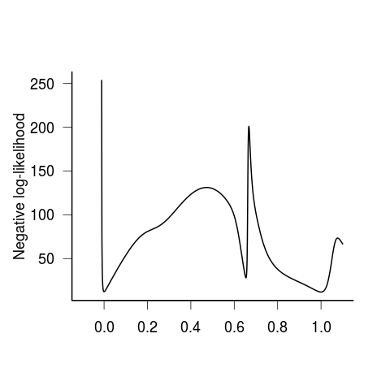
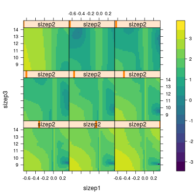

Licensed under the 
[Creative Commons attribution-noncommercial license](http://creativecommons.org/licenses/by-nc/3.0/).
Please share \& remix noncommercially, mentioning its origin.

# challenges & solutions

## errors/problems

optimization simply crashes due to:

- predictions outside of feasible range (counts <0, prob outside of (0,1))
- underflow/overflow
- convergence to extreme/flat ranges

(`L-BFGS-B` is particularly non-robust)

## improve objective function

- check for bugs!
- use more robust expressions
    - compute on log scale if possible
	- `1/(1+exp(-x))` (or `plogis(x)`) rather than `exp(x)/(1+exp(x))`
    - use `lower.tail=` for tail probabilities
- "clamping": impose minima/maxima to avoid over/underflow (e.g. see `make.link("cloglog")$linkinv`)
- evaluate expressions in limits

## better starting conditions

- better understanding of problem
- neutral values (e.g. $\beta=0$ for linear-like models)
- build up fit from less complex/reduced models
- heuristic *self-starting* algorithms to find starting values  
`apropos("^SS[a-z]",ignore.case=FALSE)` ([link](https://github.com/wch/r-source/blob/5a156a0865362bb8381dcd69ac335f5174a4f60c/src/library/stats/R/zzModels.R#L306-L325), [code](SSfpl.R))
     
## convergence warnings

- always check `$convergence` (`$status` in `nloptr`)!  
`optim()` doesn't automatically report
- from optimization algorithm (internal): e.g. see `?optim`, or this SO post on the [infamous nlminb "false convergence" warning](https://stackoverflow.com/questions/40039114/r-nlminb-what-does-false-convergence-actually-mean)

## KKT (Kuhn-Karush-Tucker) conditions

- first and second order conditions for "nonlinear programming", i.e. nonlin optimization with constraints ([Wikipedia](https://en.wikipedia.org/wiki/Karush%E2%80%93Kuhn%E2%80%93Tucker_conditions))
- `optextras::kktchk()`
- unconstrained: simplifies to gradient=0, Hessian=positive definite (for minimization)

## lme4 warnings

- "toast-scraping" (see [here](https://stat.ethz.ch/pipermail/r-sig-mixed-models/2018q2/026756.html))
- generally identifies less-stable problems (grad>0.1 is often a problem)
- not many solutions other than scaling, centering, trying other optimizers

## lots of parameters (high dimensionality)

- not really an intrinsic problem
- hard to visualize
- slow

## visualization

- slices
- `expand.grid()` plus ggplot (`geom_tile()` + `facet_grid()` works up to 4D: maybe `ggforce::facet_grid_paginate()` if you're crazy)

## slowness

- @ross_faster_2013 [link](http://www.noamross.net/blog/2013/4/25/faster-talk.html):
      - rewrite in C++
      - parallelize (hard in this case)

## discontinuities and thresholds

- Nelder-Mead
- profiling across discrete values  
general approach for any "difficult" parameter, e.g. $t$ degrees of freedom

## multi-modality

- can be very hard to tell (Simon Wood examples)
- check convergence
- KKT criteria, locally
- multi-start algorithms
     - random
	 - Latin hypercube
	 - Sobol sequences
- cumulative distribution of neg log likelihoods [@raue_lessons_2013]
- stochastic global optimization

## constraints (box)

- independent inequality constraints
- built into some optimizers (`optim/L-BFGS-B`, `nloptr` tools)
- transformations 
     - convenient; can also improve Wald approximation, improve scaling
     - bad if parameter is actually *on* the boundary
- e.g. negative binomial parameter: var=$\mu(1+\mu/k)$.  Often use $\log(k)$ to keep it positive, but what if equi/underdispersed?  Use $1/k$ with lower bound at 0?

## parameterization

- mathematically pretty: $ax/(1+bx)$
- simpler units: $ax/(1+x/c)$
- traditional: $ax/(1+ahx)$
- separate features: $ax/(1+(a/d)x)$, $d>0$

## references
