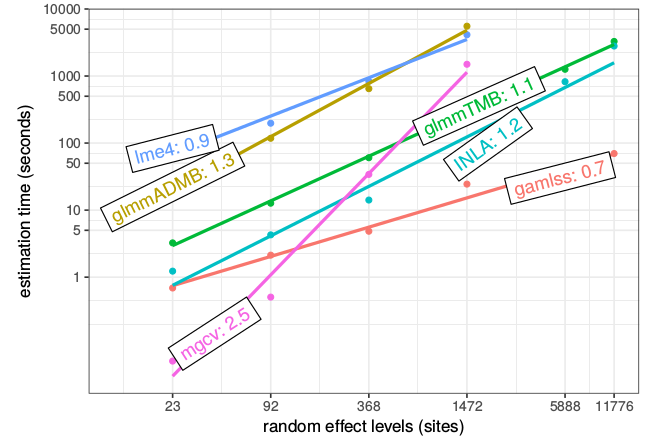
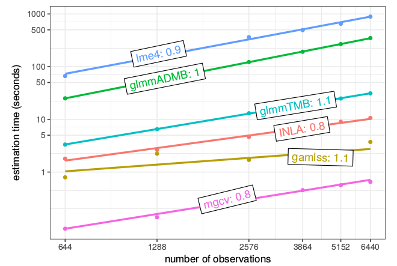

Licensed under the 
[Creative Commons attribution-noncommercial license](http://creativecommons.org/licenses/by-nc/3.0/).
Please share \& remix noncommercially, mentioning its origin.

```{r pkgs, echo=FALSE,message=FALSE}
library(glmmTMB)
```

## what does it do?

- extended generalized linear mixed models
- arbitrarily many, crossed random effects
- zero-inflation, with fixed and random covariates
- wide range of distributions (beta-binomial, Beta, COM-Poisson, generalized Poisson ...)
- dispersion model (fixed covariates)
- spatial and temporal correlations (new!)

## how does it work?

- a flexible (pre-compiled) TMB file
- data processing done in R, then passed to TMB

## speed (negative binomial model)





## example

```{r owls}
library(glmmTMB)
data("Owls", package="glmmTMB")
owls_nb1 <- glmmTMB(SiblingNegotiation ~ FoodTreatment*SexParent +
                      (1|Nest)+offset(log(BroodSize)),
                    family = nbinom1(), zi = ~FoodTreatment,
                    data=Owls)
summary(owls_nb1)
library(broom.mixed)
tidy(owls_nb1)
```

## what to worry about?

- less graceful with singular fits than `lme4`
- only does generalized *linear* mixed models
