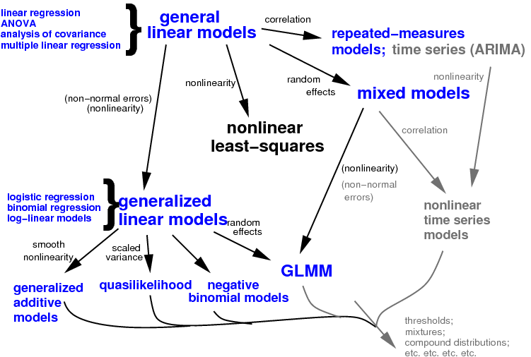

- introductions
- course material: https://github.com/bbolker/quebec_2019 and https://bbolker.github.io/quebec_2019
- data sets
- please ask questions!

## outline

- likelihood estimation and inference
- nonlinear optimization methods
- simple MLE examples
- latent variables/random effects in nonlinear models
- (extended generalized linear mixed models)
- complex examples/nonlinear mixed models

## tentative schedule

- 0830-1000: review of likelihood/inference, optimization methods, parameterization (from a geometric perspective)
- 1000-1030: break
- 1030-1200: simple examples with `bbmle`/`optim`
- 1200-1330: lunch
- 1330-1500: latent/mixed models
- 1500-1530: break
- 1530-1700: advanced examples with `nlmer`/`TMB`/etc.
