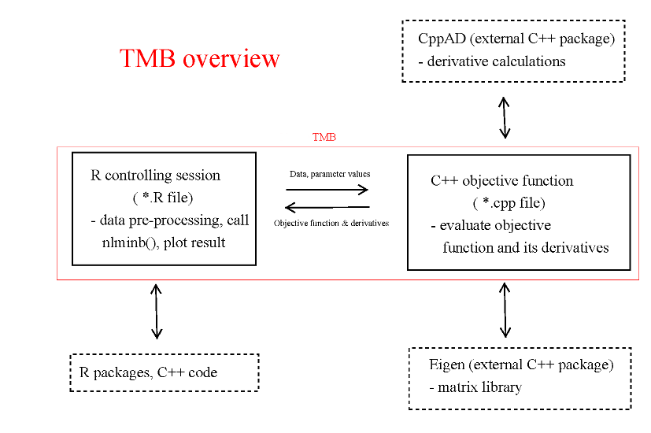

Licensed under the 
[Creative Commons attribution-noncommercial license](http://creativecommons.org/licenses/by-nc/3.0/).
Please share \& remix noncommercially, mentioning its origin.

```{r pkgs,message=FALSE}
library(rstan)
library(Deriv)
library(TMB)
library(emdbook)
library(nimble)
```

## calculating derivatives

- by hand (ugh)
- `deriv(..., function.args=...)`
     - returns 
	 
```{r}
(f1 <- deriv(~ 1/(a+b*exp(-x)), c("a","b"),
             function.arg=c("a","b","x")))
f1_g <- function(a,b,x) {
  attr(f1(a,b,x),"grad")
}
```
(wasteful but I don't know of a better pattern)

The `Deriv` package is much more flexible than the built-in `deriv()` function: allows user-specified rules

```{r}
log_dpois_symb <- ~ x*log(lambda)-lambda/lfactorial(x)
## deriv(log_dpois_symb,"lambda")
library("Deriv")
drule[["dpois"]] <- alist(lambda=x/lambda - 1/lfactorial(x),
                          x=log(lambda)-lambda*-digamma(x+1)/lfactorial(x)^2)
Deriv(~dpois(y,1/(1+exp(a+b*x))),c("a","b"))
```

## automatic differentiation

- "magic" algorithm ([Wikipedia](https://en.wikipedia.org/wiki/Automatic_differentiation)) [@griewank_automatic_1989; @griewank_achieving_1992]
- computing objective function and **all** derivatives for not much more than just the objective function cost
- automated version of the chain rule

```{r}
deriv(~x^2+y^2, c("x","y"))
```

## Laplace approximation

- built into TMB
- also INLA

## TMB

- Template Model Builder
- autodiff+Laplace
- `compile()` + `dyn.load()` + `MakeADFun()` + optimize

## TMB challenges

- installing compilation tools
- vectorization or not?
- parameter types

---



# Tadpoles in TMB

```{r}
writeLines(con="tadpole1.cpp",
           "// Tadpole example
#include <TMB.hpp>
// next two lines are magic
template<class Type> 
Type objective_function<Type>::operator() ()
{
  DATA_VECTOR(Initial);
  DATA_VECTOR(Killed);
  PARAMETER(a); // scalar parameters
  PARAMETER(h);
  Type nll = 0; // negative log-likelihood
  for (int i=0; i < Killed.size(); i++) {
      nll -= dbinom(Killed(i), Initial(i), a/(1+a*h*Initial(i)), true);
  }
  return nll;
}
")
```

[TMB documentation for probability distributions](https://kaskr.github.io/adcomp/group__R__style__distribution.html)

```{r compile,cache=TRUE}
compile("tadpole1.cpp")
```

```{r}
dyn.load(dynlib("tadpole1"))
data(ReedfrogFuncresp)
obj <- MakeADFun(as.list(ReedfrogFuncresp),
                 list(a=1, h=1),
                 DLL="tadpole1",
                 silent=TRUE)
## try out function and gradient
obj$fn(a=1,h=1)
obj$gr(a=1,h=1)
res <- do.call("optim",obj)  ## could also use nlminb etc.
```

Inference:

```{r eval=FALSE}
vv <- sdreport(obj)$cov.fixed
sds <- sqrt(diag(vv))
tmbprofile(obj,"a")
tmbroot(obj,"a")
```

**exercise**: 

## Stan

Stan [function reference](https://mc-stan.org/docs/2_18/functions-reference/)
```{r show_stanmodel,echo=FALSE}
cat(readLines("tadpole.stan"))
```
```{r build_stan,cache=TRUE}
m <- stan_model(file = "tadpole.stan", model_name = "tadpole")
```

```{r fit_stan}
fit <- optimizing(m, data = c(as.list(ReedfrogFuncresp),
                              N= nrow(ReedfrogFuncresp)))
```
  
## NIMBLE

```{r cache=TRUE,message=FALSE}
hollingprob <- nimbleFunction(
 run = function(x = integer(1), x0=integer(1), a = double(), h = double()) {
   returnType(double())
   return(-sum(dbinom(x, prob=a/(1+a*h*x0), size=x0, log=TRUE)))
 })
with(ReedfrogFuncresp,hollingprob(Killed, Initial, a=0.01,h=1))
cc <- compileNimble(hollingprob, showCompilerOutput=TRUE)
with(ReedfrogFuncresp,cc(Killed, Initial, a=0.01,h=1))
```


## other choices

- [greta](https://greta-stats.org/): R -> Tensorflow interface. Hamiltonian Monte Carlo only
- [NIMBLE](https://r-nimble.org/): modeling language -> MCMC, particle filtering, 
- [Rcpp](http://www.rcpp.org/): C++ in R; make objective function faster ...

